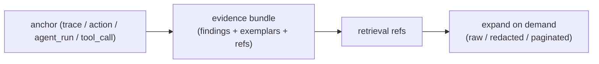

Evidence retrieval — obs-unified's **compressed context retrieval (CCR)** layer —
turns raw observability data into compact, agent-sized evidence. Instead of an
agent expanding a whole trace and every correlated log into its context window,
the collector returns a small **evidence bundle**: the critical-path summary, the
failed-span anchor, a few log exemplars, and **retrieval refs** the agent can
expand on demand.

The goal is the same symptom → evidence → root cause loop, but within a token
budget: keep the debugging signal, drop the redundancy.

## Why it exists

A single failing checkout trace can carry hundreds of correlated, near-identical
logs. Pasting all of that into an agent is expensive and drowns the signal. CCR
compacts repeated records into exemplars, preserves the findings that matter
(e.g. the failed `payment.authorize` span), and hands back references the agent
can expand only if it needs the raw rows.

## MCP tools

The [MCP server](/docs/mcp-server) exposes four read-only tools for this layer:

- `get_evidence_bundle` — compact evidence for a `trace`, `action`, `agent_run`,
  or `tool_call` anchor, scoped to an investigation intent and a token budget.
- `retrieve_evidence_ref` — expand a bundle retrieval ref into raw,
  less-compacted, or redacted records. `chunkOffset` paginates replay event
  windows.
- `search_evidence_ref` — search within a log retrieval ref without expanding the
  full evidence slice.
- `get_evidence_stats` — issued/expanded evidence-ref telemetry for the active
  project.

Bundles and refs use the [`EvidenceReference`](/docs/evidence-reference) contract
(`@obsunified/types`), so confidence, citations, and `suggestedNextPivots` carry
through. Retrieval is project-scoped: replay event windows and profile frame
summaries require explicit expansion, AI raw request/response data stays
redacted, and tool expansion returns hashes plus redacted args/results.

## What a bundle preserves

- The critical-path summary for the anchor.
- Failed-span evidence (the debugging anchor is never compacted away).
- Log exemplars with compaction provenance (how many records collapsed into each).
- Causal context for action/agent-run/tool-call anchors: side-effect, approval,
  eval, trace, and log links.

## Reduction, measured

CCR keeps its product claim executable. The repo ships a deterministic benchmark
(`pnpm benchmark:ccr`) that runs the bundle path against a checkout failure with
500 correlated `404` logs and asserts the bundle still compacts and still keeps
the failed-payment anchor. On the reference scenario it reduces a ~50k-token raw
context to ~1.3k tokens (~97% fewer tokens) while preserving the failed-span
finding. See
[`docs/benchmarks/evidence-retrieval-ccr.md`](https://github.com/obs-unified/obs-unified/blob/main/docs/benchmarks/evidence-retrieval-ccr.md)
for the current numbers and methodology — re-run the benchmark before changing
any CCR reduction claim.

## Related

- [Evidence reference](/docs/evidence-reference) — the `EvidenceReference` contract
  bundles and refs are built on.
- [MCP server](/docs/mcp-server) — the read boundary that exposes these tools.
- [RFC 0011 — Evidence retrieval layer](https://github.com/obs-unified/obs-unified/blob/main/rfcs/0011-evidence-retrieval-layer.md)
  — the design.
