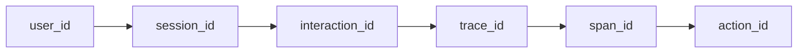
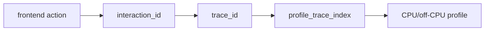

obs-unified is unified observability for every signal, built for agentic debugging. Traces, logs, AI calls, agent actions, usage events, replays, alerts, profiles, and analyses flow into **one collector**, share **one identity chain**, and appear in **one telemetry graph** agents can traverse from user action to backend trace, logs, replay, AI cost, MCP tool context, and CPU profile.

Self-hosting is the deployment model, not the whole pitch: the default hosted path runs on Cloudflare Workers with D1 and R2, while the Node collector path uses Postgres and S3-compatible blob storage.

## What's in this documentation

- [Getting started](/docs/getting-started) — choose Docker or local dev, then choose seeded data, Astronomy Shop, or your own app.
- [Installation](/docs/installation) — the shortest current install path for the all-in-one local image and the editable local repo.
- [Examples](/docs/examples) — runnable demos, scaffold templates, SDK examples, recipes, and migration guides.
- [SDKs](/docs/sdks) — `@obs-unified/analytics-sdk` (browser, click + interaction propagation), `@obs-unified/telemetry-sdk` (Node/Workers), plus Go and Rust.
- [SDK API reference](/docs/sdk-reference) — compact method map for init, interaction stamping, LLM/tool spans, MCP context propagation, and Cloudflare wrappers.
- [Evidence reference](/docs/evidence-reference) — machine-readable evidence references with entity IDs, routes, confidence, citations, and pivots.
- [Evidence retrieval (CCR)](/docs/evidence-retrieval) — compact, token-budgeted evidence bundles and retrieval refs that let agents pull just the debugging signal, not the raw firehose.
- [Agent Action Graph](/docs/agent-action-graph) — debug agent runs as causal workflows across LLM calls, retrievals, tool calls, traces, logs, profiles, and eval cases.
- [MCP server](/docs/mcp-server) — expose read-only investigation tools to AI agents without granting ingest credentials.
- [Instrumenting](/docs/instrumenting) — concrete React + Worker examples that produce signals correlated end-to-end.
- [Python Flask instrumentation](/docs/instrument-python-flask) — OpenTelemetry setup for a Flask service.
- [What to expect](/docs/what-to-expect) — the click-to-CPU scenarios the platform was built around, with the rail's role at every hop.
- [Production operations](/docs/ops/production) — reverse proxy, Postgres tuning, storage retention, and Kubernetes notes.
- [Vendor comparison](/docs/comparison) — side-by-side feature comparison with Datadog, Sentry, and PostHog.

## The unified-stack promise

That identity skeleton is the unifying layer. The SDKs propagate it, the collector stores it, and the dashboard plus MCP server use it to connect product behavior, backend execution, agent actions, AI cost, logs, replay, alerts, profiles, and analyses. Read the [SDKs](/docs/sdks) page for which ID is minted where, [Agent Action Graph](/docs/agent-action-graph) for agent causality, and [What to expect](/docs/what-to-expect) for the journeys it makes possible.

The click-to-CPU path is deliberately precise: the browser mints `interaction_id`, the backend stamps it onto spans/logs/AI calls/MCP tool context, and profiles join through the `trace_id` those spans belong to. In shorthand:

<Callout type="info">
This documentation describes the platform as it ships on `main` today. For the fastest first run, use the all-in-one Docker image from [Getting started](/docs/getting-started).
</Callout>
