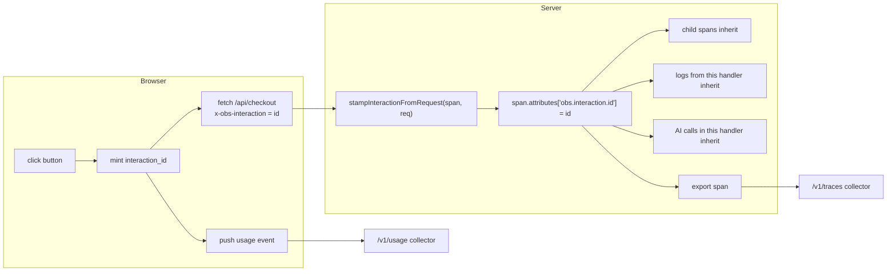

This page walks through wiring `@obs-unified/analytics-sdk` and `@obs-unified/telemetry-sdk` into a real two-tier app — a React frontend that calls a Worker backend — so a single user click produces a usage event, a span, a log, and (optionally) an AI call, all carrying the same `interaction_id`.

## What "end-to-end correlation" means here



Every signal that flows out of the server while that request is in flight carries the same `interaction_id`. The dashboard's [Connected rail](/docs/what-to-expect) reads that column to surface "the click that caused this trace" in one click.

## Frontend (React + Vite)

### 1. Install + wrap

```tsx
// src/main.tsx
import { AnalyticsProvider, AnalyticsErrorBoundary } from "@obs-unified/analytics-sdk/react";
import { createRoot } from "react-dom/client";
import { App } from "./App";

createRoot(document.getElementById("root")!).render(
	<AnalyticsProvider
		collectorUrl={import.meta.env.VITE_OBS_COLLECTOR_URL}
		apiKey={import.meta.env.VITE_OBS_INGEST_KEY}
		trackPageViews
		captureErrors
		trackOutboundLinks
		storagePrefix="myapp"
	>
		<AnalyticsErrorBoundary context="App" fallback={<div>Something crashed.</div>}>
			<App />
		</AnalyticsErrorBoundary>
	</AnalyticsProvider>,
);
```

By default `AnalyticsProvider` installs **Mode A auto-correlation**: clicks/submits/keydowns mint `interaction_id` and `window.fetch` is patched to inject `x-obs-interaction`. No per-button wiring needed for the happy path.

### 2. Identify your user

```tsx
import { useEffect } from "react";
import { useAnalytics } from "@obs-unified/analytics-sdk/react";

export function App() {
	const { identify } = useAnalytics();

	useEffect(() => {
		const user = readCurrentUser();
		if (user) {
			identify(user.id, {
				email: user.email,
				plan: user.plan,
				role: user.role,
			});
		}
	}, [identify]);

	return <Routes />;
}
```

After this call, the dashboard's user-detail page (`/#/users/<userId>`) shows this user's sessions, traces, AI calls, and replay.

### 3. Track meaningful interactions explicitly

Auto-tracked clicks give you a usage event for every DOM click, which is noisy. For business-meaningful events, track explicitly:

```tsx
const { trackInteraction } = useAnalytics();

const onSubmit = async () => {
	const res = await fetch("/api/checkout", { method: "POST" });
	trackInteraction("checkout_submitted", {
		status: res.status,
		cartValue: cart.total,
	});
};
```

### 4. Mode B for async work

```tsx
import { useAnalytics } from "@obs-unified/analytics-sdk/react";

export function DebouncedSearchBox() {
	const { withInteraction } = useAnalytics();

	const onChange = withInteraction(
		debounce(async (query: string) => {
			// Even after the debounce delay, this fetch carries the
			// click's interaction_id because withInteraction snapshotted
			// it at call time.
			await fetch(`/api/search?q=${query}`);
		}, 300),
	);

	return <input onChange={(e) => onChange(e.target.value)} />;
}
```

## Backend (Cloudflare Worker / Hono)

### 1. Two middlewares

```ts
// src/index.ts
import { Hono } from "hono";
import { cors } from "hono/cors";
import {
	createRequestSpan,
	initObservability,
	runWithSpan,
	stampInteractionFromRequest,
	flushLogs,
	flushAICalls,
} from "@obs-unified/telemetry-sdk";

const app = new Hono<{ Bindings: Env }>();

// CORS — explicitly allow the obs headers or the browser will strip
// them via preflight.
app.use(
	"*",
	cors({
		origin: ["https://app.example.com"],
		credentials: true,
		allowHeaders: ["Content-Type", "Authorization", "X-Obs-Session-Id", "x-obs-interaction"],
	}),
);

// Bootstrap the SDK once per request.
app.use("*", async (c, next) => {
	initObservability({
		collectorUrl: c.env.OBS_COLLECTOR_URL,
		apiKey: c.env.OBS_INGEST_KEY,
		serviceName: "checkout-api",
	});
	await next();
});

// Root span + interaction stamping.
app.use("*", async (c, next) => {
	const span = createRequestSpan("checkout-api", `${c.req.method} ${c.req.path}`);
	span.setAttribute("http.request.method", c.req.method);
	span.setAttribute("url.path", c.req.path);
	stampInteractionFromRequest(span, c.req.raw);
	const sessionId = c.req.header("x-obs-session-id");
	if (sessionId) span.setAttribute("session.id", sessionId);

	try {
		await runWithSpan(span, () => next());
		span.setAttribute("http.response.status_code", c.res.status);
		span.setStatus(c.res.status >= 400 ? 2 : 1);
	} catch (err) {
		span.setStatus(2, err instanceof Error ? err.message : String(err));
		throw err;
	} finally {
		span.end();
		await exportSpan(c.env, span);
		await Promise.all([flushLogs(), flushAICalls()]).catch(() => {});
	}
});
```

### 2. Child spans + logs in your handlers

```ts
import { withChildSpan, createLogger } from "@obs-unified/telemetry-sdk";

const log = createLogger("checkout-api");

app.post("/api/checkout", async (c) => {
	const { items } = await c.req.json();

	const user = await withChildSpan("db.query.user", async (child) => {
		child.setAttribute("db.system", "postgres");
		return await db.query("SELECT * FROM users WHERE id = $1", [c.var.userId]);
	});

	log.info("Charging payment", { userId: user.id, total: cart.total });

	const charge = await withChildSpan("payment.charge", async (child) => {
		child.setAttribute("stripe.amount", cart.total);
		return await stripe.charges.create({ amount: cart.total });
	});

	return c.json({ chargeId: charge.id });
});
```

Both the child spans and the log inherit `interaction_id` from the root span. Everything ends up correlated.

### 3. AI calls

If your backend invokes an LLM, instrument it as an OpenInference-typed span:

```ts
import { setAISessionContext } from "@obs-unified/telemetry-sdk";

setAISessionContext({ sessionId, userId });

const response = await openai.chat.completions.create({ /* ... */ });
// The SDK's OpenAI wrapper (or your own typed helper) emits a span
// with openinference.span.kind=LLM, llm.cost_usd, llm.token_count.*, etc.
```

AI calls also land in the `ai_calls` denormalized table that the dashboard's AI tab and the Connected rail's "AI calls in this trace" section both read.

## What you should see

After wiring both ends and hitting a route, open the dashboard:

1. **Usage tab** — your tracked interaction appears
2. **Traces tab** — the root span + child spans, with `obs.interaction.id` in attributes
3. **Logs tab** — your `log.info("Charging payment", …)` row, joined to the trace
4. **AI Calls tab** — the LLM span (if any), joined to the same trace
5. **Replay tab** — the user's session, with the interaction listed under "Interactions in this session" — clicking it opens the trace that the click caused

If "Click that caused this trace" on the span detail rail shows the absence text (`Server-originated work — not bound to a user click`), the most common causes are:

- The browser SDK isn't installed or `installAutoCorrelate` was disabled
- CORS preflight is stripping `x-obs-interaction` — add it to `allowHeaders`
- The server isn't calling `stampInteractionFromRequest()` on the root span

## Going further

- **Multiple services**: each service initializes the SDK with its own `serviceName`. The OTLP `traceparent` header propagates trace context across service boundaries; `x-obs-interaction` propagates the click-scoped key. Native `fetch` doesn't forward arbitrary headers — pass them explicitly when fanning out:

  ```ts
  await fetch(downstreamUrl, {
  	headers: {
  		"x-obs-interaction": c.req.header("x-obs-interaction") ?? "",
  		traceparent: c.req.header("traceparent") ?? "",
  	},
  });
  ```

- **Node.js (non-Workers)**: same SDK, just call `initObservability` once at startup. The `flushLogs` / `flushAICalls` calls become periodic background tasks instead of per-request flushes.

- **eBPF agents**: drop in [Beyla](https://grafana.com/oss/beyla/) pointed at the obs-unified collector's `/v1/traces` and it'll emit spans tagged `telemetry.sdk.name=beyla`. The dashboard's Service Map tab filters by `SDK | eBPF | ALL`.
