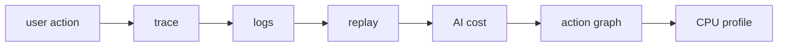

`@obsunified/mcp-server` is a stdio Model Context Protocol server for agents
that need to inspect an obs-unified collector.

It exposes the same investigation graph that humans use in the dashboard:
status, recent traces, trace detail, service operations, service map, logs, AI
sessions, users, replays, profiles, evals, compact evidence bundles, connected
signals, agent runs, actions, and tool calls.

## Why it exists

Modern debugging is increasingly agent-assisted. Instead of asking an agent to
guess from screenshots or copy-pasted log snippets, obs-unified gives it
structured tools over the telemetry graph:



The MCP server is a **read boundary**. It lets agents traverse evidence without
granting write access to telemetry ingest.

## Install

The MCP server is published to the public npm registry:

```bash
pnpm add -g @obsunified/mcp-server
```

> [!NOTE]
> The MCP server uses the hyphen-less `@obsunified` scope on public npm (`@obsunified/mcp-server`). The first-party SDKs use the hyphenated `@obs-unified` scope on the GitHub Packages registry (`@obs-unified/*`).

For local development from a checkout:

```bash
git clone https://github.com/obs-unified/obs-unified.git
cd obs-unified
pnpm install
pnpm --filter @obsunified/mcp-server build
```

## Configure

Set the collector URL and one auth method:

```bash
export OBS_COLLECTOR_URL="https://obs.example.com"
export OBS_DASHBOARD_TOKEN="..."
```

Supported auth variables, in priority order:

- `OBS_DASHBOARD_TOKEN` — programmatic dashboard token, sent as a bearer token.
- `OBS_INGEST_KEY` — project ingest key, sent as a bearer token for collectors
  that allow it on read endpoints.
- `OBS_SESSION_COOKIE` — dashboard `obs_session` cookie value for ad-hoc local
  use.

Optional variables:

- `OBS_PROJECT_ID` — sent as `X-Project-Id` for multi-project collectors.
- `OBS_DASHBOARD_URL` — used to include dashboard deep links in tool responses.
- `OBS_MCP_TIMEOUT_MS` — request timeout in milliseconds. Defaults to `30000`.

## Claude Desktop or compatible local MCP host

```json
{
  "mcpServers": {
    "obs-unified": {
      "command": "obs-unified-mcp",
      "env": {
        "OBS_COLLECTOR_URL": "https://obs.example.com",
        "OBS_DASHBOARD_TOKEN": "..."
      }
    }
  }
}
```

For local development from the monorepo:

```json
{
  "mcpServers": {
    "obs-unified": {
      "command": "pnpm",
      "args": [
        "--dir",
        "/absolute/path/to/obs-unified",
        "--filter",
        "@obsunified/mcp-server",
        "start"
      ],
      "env": {
        "OBS_COLLECTOR_URL": "http://localhost:8790",
        "OBS_INGEST_KEY": "dev"
      }
    }
  }
}
```

Build the package first with:

```bash
pnpm --filter @obsunified/mcp-server build
```

## Tools

- `obs_status`
- `get_evidence_bundle` — compact evidence for a `trace`, `action`, `agent_run`, or `tool_call` anchor, scoped to an investigation intent and token budget.
- `retrieve_evidence_ref` — expand a bundle retrieval ref into raw, less-compacted, or redacted records (`chunkOffset` paginates replay event windows).
- `search_evidence_ref` — search within a log retrieval ref without expanding the full evidence slice.
- `get_evidence_stats` — issued/expanded evidence-ref telemetry for the active project.
- `recent_traces`
- `get_trace`
- `service_operations`
- `service_map`
- `search_logs`
- `ai_overview`
- `get_ai_session`
- `get_user`
- `get_replay`
- `get_profile`
- `get_eval`
- `connected_signals`
- `get_agent_run`
- `get_action`
- `get_tool_call`

For package-level details, see the
[MCP server README](https://github.com/obs-unified/obs-unified/blob/main/packages/mcp-server/README.md).
