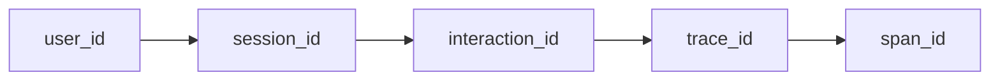
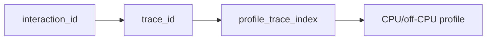

obs-unified ships first-party SDKs for **three backend languages** plus a browser SDK and an MCP server for AI agents, all sharing one identity-propagation contract.

For a compact method-by-method cheat sheet, see [SDK API reference](/docs/sdk-reference).

For the agent-facing investigation surface, see [MCP server](/docs/mcp-server).

## Backend SDKs

| Language | Install | Where it runs |
| --- | --- | --- |
| **TypeScript** | `pnpm add @obsunified/telemetry-sdk` from npm | Node.js · Bun · Deno · Cloudflare Workers |
| **Go** | `go get github.com/obs-unified/obs-unified/sdks/go@latest` | Any Go 1.22+ binary |
| **Rust** | `cargo add obs-unified` | Any Rust 1.75+ binary (Tokio runtime) |

All three expose the **same API surface**, so muscle memory ports across runtimes:

| Concept | TypeScript | Go | Rust |
| --- | --- | --- | --- |
| Init | `initObservability(config)` | `obs.Init(ctx, cfg)` | `obs_unified::init(cfg)` |
| HTTP stamp | `stampInteractionFromRequest(span, req)` | `obs.StampInteraction(ctx, r)` | `obs_unified::stamp_interaction(span, req)` |
| LLM span | `startLLMSpan(name, opts)` | `obs.StartLLMSpan(ctx, name, opts)` | `start_llm_span(name, opts)` |
| Tool span | `startToolSpan(name, opts)` | `obs.StartToolSpan(ctx, name, opts)` | `start_tool_span(name, opts)` |
| Project ID | `extraHeaders: { "x-project-id": id }` | `obs.SetProjectID(ctx, id)` | `set_project_id(id)` |

These are deliberately **thin wrappers around OpenTelemetry**: one-line collector init, OpenInference-shaped helpers so LLM/tool spans render in the dashboard's AI tab, project-id propagation for multi-tenant, and the loop-guard header for services that ingest their own telemetry. HTTP server/client and database instrumentation come from the OTel ecosystem of your language (`@opentelemetry/instrumentation-http`, `otelhttp`, `tower-http` + `tracing-opentelemetry`, etc.).

If your backend language isn't listed, any OTLP-compatible OpenTelemetry SDK works as a fallback — you just lose the `x-obs-interaction` click-to-trace stitching unless you set the header yourself.

## Browser SDK

| Package | Where it runs | What it does |
| --- | --- | --- |
| `@obsunified/analytics-sdk` | Browser (React or vanilla) | Tracks usage events, identifies users, mints **interaction_id** on every click, auto-injects `x-obs-interaction` on outbound `fetch`/XHR |

This one is browser-only by definition — there's no parallel Go/Rust analytics SDK because that surface area is the web.

All four packages live in the obs-unified monorepo. The TypeScript packages publish to public npm under `@obsunified/*`. The Go SDK is consumed from the public `sdks/go` module path through Go module tags like `sdks/go/v0.1.0`. The Rust SDK publishes to crates.io as `obs-unified`.

## MCP server

| Package | Where it runs | What it does |
| --- | --- | --- |
| `@obsunified/mcp-server` | Local MCP host over stdio | Exposes read-only investigation tools for status, recent traces, trace detail, service maps, logs, AI sessions, users, replays, profiles, evals, compact evidence bundles, connected signals, agent runs, actions, and tool calls |

The MCP server is intentionally a **read boundary**. Agents can inspect the same graph a human sees in the dashboard, but they do not need the write-only telemetry ingest key used by app SDKs. Configure it with a dashboard token, a compatible read bearer, or a local `obs_session` cookie for development.

See [MCP server](/docs/mcp-server) for install and host configuration.

> [!NOTE]
> The MCP server uses the `@obsunified` scope on public npm (`@obsunified/mcp-server`). The first-party SDKs use the `@obsunified` scope on public npm (`@obsunified/*`).

### npm install

```bash
pnpm add @obsunified/telemetry-sdk
pnpm add @obsunified/analytics-sdk
```

## The identity skeleton



The browser SDK owns the left half (user / session / interaction). The server SDK owns the right half (trace / span). Agent helpers and MCP context propagation extend that same skeleton across agent runs, actions, and tool calls. They meet at the **`x-obs-interaction` request header** that the browser sets on outbound fetches and the server stamps onto the resulting span.

Once a signal carries `interaction_id`, the dashboard's [Connected Rail](/docs/what-to-expect) can pivot from any entity to "the click that caused this trace" in one click.

For CPU and off-CPU work, `interaction_id` is the entry key, not the profiler's storage key. Profiles are indexed by `trace_id`; when a profiled service labels samples with trace IDs, the path becomes:



## @obsunified/analytics-sdk

### Install

```bash
pnpm add @obsunified/analytics-sdk
```

For React hosts the SDK exports a provider component; for other hosts call the lower-level `installAutoCorrelate()` directly.

### React quick start

```tsx
import { AnalyticsProvider, AnalyticsErrorBoundary } from "@obsunified/analytics-sdk/react";

export function Root() {
	return (
		<AnalyticsProvider
			collectorUrl="https://your-collector.example.com"
			apiKey={import.meta.env.VITE_OBS_INGEST_KEY}
			trackPageViews
			captureErrors
			storagePrefix="myapp"
		>
			<AnalyticsErrorBoundary context="App" fallback={<ErrorPage />}>
				<App />
			</AnalyticsErrorBoundary>
		</AnalyticsProvider>
	);
}
```

The provider:

- Mints a `session_id` on first mount, persists it for ~30 minutes of inactivity
- Tracks page views automatically on `pushState` / `popstate`
- Captures uncaught errors and unhandled promise rejections
- Installs the **Mode A** auto-correlator: a global capture-phase listener on `click`, `submit`, `keydown` that mints a fresh `interaction_id`, plus a global `fetch` + `XMLHttpRequest` wrapper that injects the `x-obs-interaction` header on outbound requests
- Provides `useAnalytics()` hook for explicit calls

### Inside a component

```tsx
import { useAnalytics } from "@obsunified/analytics-sdk/react";

export function CheckoutButton() {
	const { trackInteraction, identify, withInteraction } = useAnalytics();

	const onSubmit = withInteraction(async () => {
		// fetch() inside here automatically carries x-obs-interaction
		const res = await fetch("/api/checkout", { method: "POST" });
		trackInteraction("checkout_submitted", { status: res.status });
	});

	return <button onClick={onSubmit}>Place order</button>;
}
```

### Identifying users

```ts
identify("user-42", { email: "alice@example.com", plan: "pro" });
```

Calls `POST /v1/identify` on the collector with `userId`, `visitorId`, `email`, `name`, `properties`. The endpoint upserts into `user_profiles` and uses `MIN(...)` to preserve the earliest `first_seen_at` on conflict.

For historical imports / backfills, you can also pass an optional `firstSeenAt` ISO timestamp:

```ts
await fetch(`${collector}/v1/identify`, {
	method: "POST",
	body: JSON.stringify({
		userId: "user-42",
		visitorId: "vis-abc",
		email: "alice@example.com",
		firstSeenAt: "2026-01-15T08:30:00Z",
	}),
});
```

Future timestamps are rejected silently — clock-skewed clients can't poison the table.

### Mode B: explicit interaction context

Auto-correlation (Mode A) handles synchronous handlers and shallow `await` chains. Deeper async flows (debounces, setTimeout-queued work, state-machine transitions) escape the microtask cascade. For those, use `withInteractionContext`:

```ts
import { withInteractionContext, currentInteractionId } from "@obsunified/analytics-sdk";

// Capture at click time
const id = currentInteractionId();

// Re-enter the context wherever the work actually happens
setTimeout(() => {
	withInteractionContext(id!, () => {
		fetch("/api/long-running"); // carries the click's interaction_id
	});
}, 500);
```

## @obsunified/telemetry-sdk

### Install

```bash
pnpm add @obsunified/telemetry-sdk
```

### Cloudflare Worker / Hono quick start

```ts
import {
	createRequestSpan,
	initObservability,
	runWithSpan,
	stampInteractionFromRequest,
	flushLogs,
	flushAICalls,
} from "@obsunified/telemetry-sdk";

app.use("*", async (c, next) => {
	initObservability({
		collectorUrl: c.env.OBS_COLLECTOR_URL,
		apiKey: c.env.OBS_INGEST_KEY,
		serviceName: "checkout-api",
	});
	await next();
});

app.use("*", async (c, next) => {
	const span = createRequestSpan("checkout-api", `${c.req.method} ${c.req.path}`);
	span.setAttribute("http.request.method", c.req.method);
	// RFC 0004 — closes the click-to-trace loop. No-op if header is missing.
	stampInteractionFromRequest(span, c.req.raw);

	try {
		await runWithSpan(span, () => next());
		span.setStatus(c.res.status >= 400 ? 2 : 1);
	} finally {
		span.end();
		await exportSpan(c.env, span);
		await Promise.all([flushLogs(), flushAICalls()]);
	}
});
```

The same primitives work in plain Node.js — replace `c.env` with `process.env`, replace the Hono context with a node request handler.

### Child spans

```ts
import { withChildSpan } from "@obsunified/telemetry-sdk";

const items = await withChildSpan("db.query.items", async (child) => {
	child.setAttribute("db.system", "postgres");
	child.setAttribute("db.statement", "SELECT * FROM items");
	return await db.query("SELECT * FROM items");
});
```

Child spans inherit the parent's trace context and interaction id automatically.

### Logs

```ts
import { createLogger } from "@obsunified/telemetry-sdk";

const logger = createLogger("checkout-api");

logger.info("Cart loaded", { cartId, itemCount: items.length });
logger.error("Stripe webhook signature failed", { traceId, error });
```

Logs are flushed at request end via `flushLogs()`. If a span is active, the log inherits `trace_id`, `span_id`, `session_id`, and `interaction_id`.

### AI calls

The SDK exposes typed helpers for OpenInference-style LLM spans:

```ts
import { setAISessionContext, startRetrieverSpan } from "@obsunified/telemetry-sdk";

setAISessionContext({ sessionId, userId });

await startRetrieverSpan("vector.search", { input: query }, async (span) => {
	span.setAttribute("retriever.k", 10);
	return await db.vectorSearch(query);
});
```

For lower-level LLM and tool spans, use `startLLMSpan()` and `startToolSpan()` as shown in [SDK API reference](/docs/sdk-reference#ai-and-llm-span-tracking).

### Cloudflare Workers bindings

Workers services can wrap platform bindings from the Cloudflare-specific entry point:

```ts
import { wrapD1, wrapFetch, wrapR2 } from "@obsunified/telemetry-sdk/cloudflare";

const db = wrapD1(env.DATABASE);
const bucket = wrapR2(env.STORAGE_BUCKET, { bucketName: "blobs" });
const telemetryFetch = wrapFetch(globalThis.fetch);
```

## Wire-format compatibility

The collector accepts standard OTLP/HTTP at:

- `POST /v1/traces` — protobuf or JSON OTLP traces
- `POST /v1/logs` — protobuf or JSON OTLP logs

So any OTel-compatible producer (the Go collector, OpenInference instrumentations, Beyla eBPF agent) works alongside the obs SDKs. The obs SDKs add the `x-obs-interaction` header and the `obs.interaction.id` span attribute — native OTel SDKs don't, which is why the [click-to-trace pivot is gated on the obs SDKs](/docs/what-to-expect#scenario-a).

## IDE deep-linking configuration

The dashboard supports deep-linking from traces, spans, and profile frames directly to files in your local editor.

### Saved IDE template
The selected editor scheme is saved in the browser's `localStorage` under the key `obs_ide_template`.

### IDE selector dropdown
In the dashboard's top bar, the `IdeSelector` dropdown lets you select your preferred IDE:
- **VS Code**: `vscode://file/{absolutePath}:{lineNumber}`
- **Cursor**: `cursor://file/{absolutePath}:{lineNumber}`
- **WebStorm**: `webstorm://open?file={absolutePath}&line={lineNumber}`
- **Custom**: A custom URI template of your choice.

### Custom templates
When configuring a custom IDE template, the following placeholders are dynamically replaced:
- `{absolutePath}`: The absolute path of the file on your local machine (e.g. `/Users/username/project/file.ts`).
- `{relativePath}`: The repository-relative path of the file (e.g. `packages/dashboard/src/app.tsx`).
- `{lineNumber}`: The 1-indexed line number.
